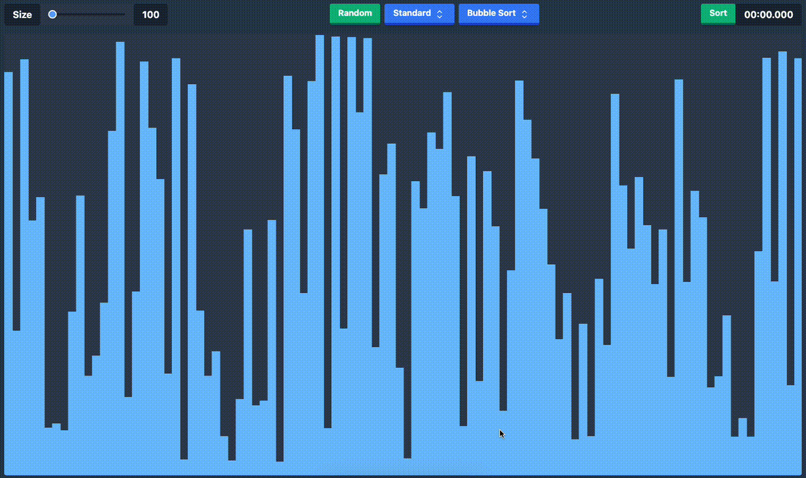
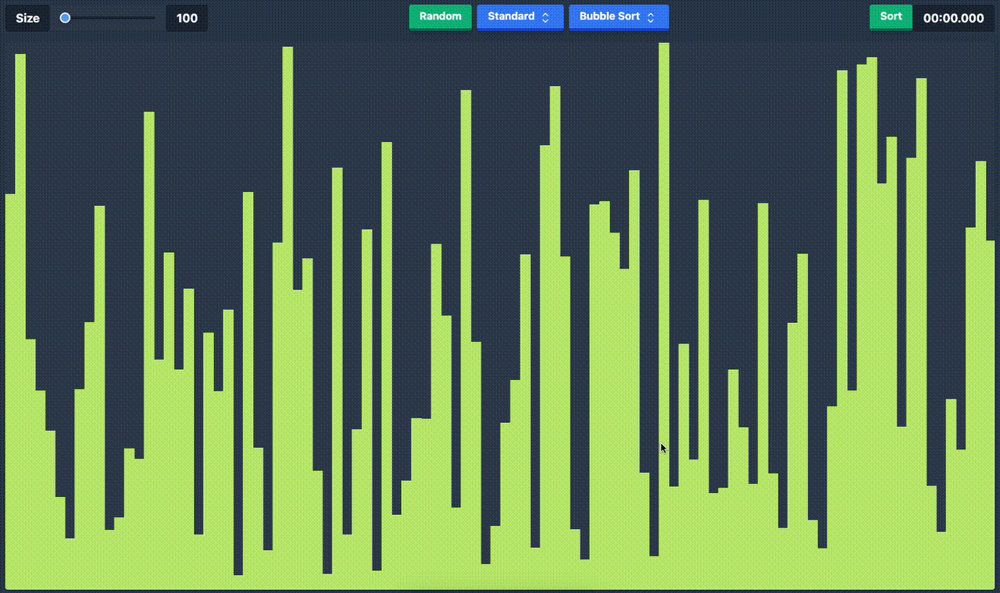

# Sorting Visualiser

A simple but energetic sorting visualiser built using the Canvas API and React that allows you to visualise sorting algorithms in real-time and compare their performance against each other.

The following sorting algorithms are implemented:

- Bubble Sort
- Selection Sort
- Insertion Sort
- Merge Sort
- Quick Sort
- Heap Sort

## Demo

### Standard View



### Compare View



## Running the project

The project is built using Webpack and Babel. To run the project, you can use one of 2 methods:

1. If you prefer using NPM

```bash
npm run dev
```

2. or if you have Docker installed

```bash
docker compose up -d

# this will expose the server on 3500
```
